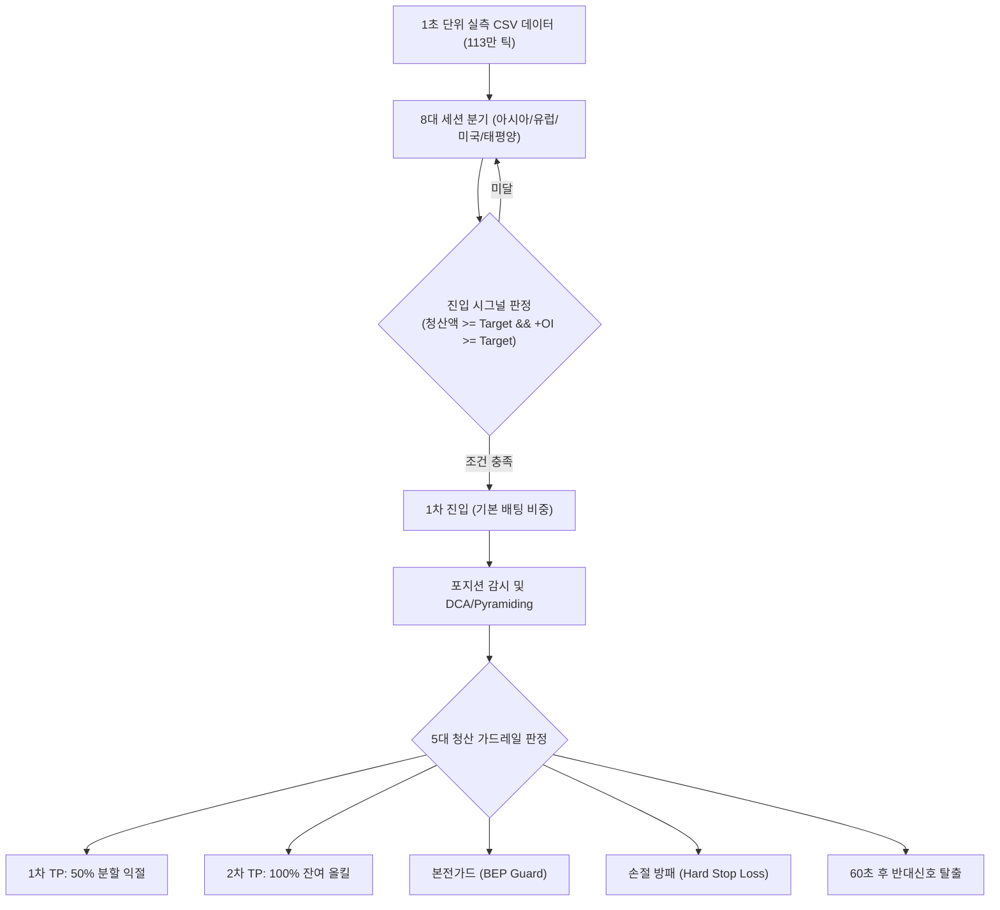

# [기획서_337] 신선 전략 백테스터(V1.0) 전체 내부 로직 정밀 백서 및 상세 분석 보고서

---

## 📌 [문서 정보]
- **문서 번호:** 기획서_337
- **작성 일자:** 2026년 8월 27일 00:55 KST
- **작성자:** 안티그래비티 (수석 개발자)
- **수신:** 국왕 폐하
- **대상 코드:** [`shinseon_backtester.pyw`](file:///C:/Working/ShinSeon_Bitget/shinseon_backtester.pyw) 및 [`backtest_engine.py`](file:///C:/Working/ShinSeon_Bitget/backtest_engine.py)
- **진행 상태:** `[ ] 폐하 검토 및 어명 대기 중`

---

## 1. 🎯 [백테스터의 목적 및 개요]
신선 백테스터는 **실제 수집된 24시간 1초 단위 실측 오더플로우 데이터(`docs/historical_data/` 및 `downloads/`)**를 기반으로, 과거 장세에서 신선의 매매 알고리즘이 얼마의 승률, 수익률, 수수료, MDD(최대 낙폭)를 기록했는지 0.001초의 오차도 없이 시뮬레이션하는 **독립 전략 검증 엔진**입니다.

---

## 2. 🔍 [백테스터 전체 파이프라인 및 4단계 로직 상세 분석]

---

### 1️⃣ [1단계: 8대 세션 자동 분기 및 파라미터 로드]
시뮬레이션 시간(KST)에 따라 8개 시간대로 자동 분기되어 서로 다른 임계치와 배팅 비중을 적용합니다.

1. **평일/주말 아시아 (09:00 ~ 16:30):** 기본 청산 `$600,000` / OI `+0.1900%` / 손절 `-0.6%`
2. **평일/주말 유럽 (16:30 ~ 22:30):** 기본 청산 `$1,400,000` / OI `+0.2800%` / 손절 `-0.8%`
3. **평일/주말 미국 본장 (22:30 ~ 05:00):** 기본 청산 `$3,000,000` / OI `+0.2800%` / 손절 `-0.8%`
4. **평일/주말 태평양 (05:00 ~ 09:00):** 기본 청산 `$800,000` / OI `+0.1700%` / 손절 `-0.6%`

---

### 2️⃣ [2단계: 진입 시그널 판정 (Signal Dominance Engine)]
매 초마다 아래 2가지 절대 헌법을 동시 검사합니다:

1. **청산 임계치 돌파:** `1분 누적 청산액 >= 세션별 target_liq`
2. **자금 유입 돌파 (+OI):** `1분 OI 속도 >= 세션별 target_oi` (양수 자금유입 전용)
3. **방향 결정:**
   - `숏 청산액 >= 롱 청산액`: 🟢 **LONG 진입** (숏 포지션 청산 폭발 + 매수 자금 유입)
   - `롱 청산액 > 숏 청산액`: 🔴 **SHORT 진입** (롱 포지션 청산 폭발 + 매도 자금 유입)

---

### 3️⃣ [3단계: 포지션 관리, 물타기(DCA) 및 불타기(Pyramiding)]
1. **1차 진입:** 세션별 설정된 1차 비중(예: 300% ~ 1500%)으로 최초 진입.
2. **2차 추매 (DCA):** 
   - 1차 평단 대비 `pnl <= dca_drop` (예: `-0.30%`) 하락하고,
   - 현재 시점에 동일한 방향의 신호(`sig_dir == direction`)가 발생하면 즉시 2차 비중 투입 ➡️ 평단가 하향 조정.
3. **3차 추매 (DCA):** 
   - 2차 추매 완료 후 `dca_time_limit` (900초) 이상 경과하고,
   - 1차 평단 대비 `-0.60%` 하락 + 동일 신호 발생 시 3차 비중 투입.
4. **눌림목 불타기 (Winning Pyramiding):**
   - 1차 익절(TP1) 성공 후 시세가 되돌림(`pnl <= tp1 - 0.3%`)을 줄 때 +30% 비중 추가 탑승.

---

### 4️⃣ [4단계: 5대 방탄 청산 및 가드레일 로직]
포지션을 청산하는 조건은 우선순위에 따라 5가지로 나뉩니다:

| 청산 종류 | 발동 조건 | 청산 수량 및 처리 방식 |
|---|---|---|
| **1. 1차 TP (분할 익절)** | `수익률 >= tp1` (예: +0.4% ~ +1.2%) | **보유 수량의 50%를 즉시 익절**하고 본전가드 활성화 |
| **2. 2차 TP (올킬 익절)** | `수익률 >= tp2` (예: +0.6% ~ +1.5%) | **잔여 50% 수량 전량 올킬 익절** (거래 종료) |
| **3. 본전가드 (BEP Guard)** | 1차 익절 완료 후 시세가 꺾여 `수익률 <= be_guard` (예: +0.1% ~ +0.5%) | **잔여 50% 수량 본전 수수료 방어 탈출** |
| **4. 중간 수익 보존가드** | 1차 익절 전 최고 수익률이 +0.6% 도달 후 꺾여 +0.2% 터치 시 | **최소 수익(+0.2%) 확보 강제 청산** |
| **5. 손절 방패 (Hard SL)** | 1차 익절 전 1차 평단 대비 `손실률 <= -sl_ratio` (예: -0.6% ~ -0.8%) | **보유 수량 100% 즉시 시장가 손절** |
| **6. 60초 후 반대신호** | 진입 후 60초 경과 시점에서 강력한 반대 세력 신호 발생 시 | **보유 수량 전량 즉시 스위칭 탈출** |

---

### 5️⃣ [5단계: 수수료 및 손익 정밀 계산 (Fee & PnL Engine)]
- **적용 수수료율:** `fee_rate = 0.0004` (0.04% / 박호두 50% 지정가/시장가 복합 기준)
- **노셔널(거래 대금):** 진입 시 거래대금 + 청산 시 거래대금 전수 합산하여 수수료 차감.
- **실질 순수익(Net Profit):** `총수익(Gross Profit) - 지불 수수료(Trade Fee)`

---

## 3. 📊 [현재 백테스터 로직에 대한 검토 및 개선 제안 포인트]

1. **진입 시그널 필터 강화:**
   - 현재는 `청산액 + +OI` 두 가지만 봅니다.
   - 여기에 **5초 가격 변동(`delta_5s`)의 최소 턴(동적 불감대)**이나 **1분 추세 슬로프(기울기)**를 함께 결합하여 필터링 강도를 조절할 수 있습니다.
2. **미국 본장 & 태평양 세션 방어:**
   - 미국 본장의 경우 고변동성 휩소가 심하므로 청산 임계치를 `$3.0M -> $4.5M`으로 올리거나,
   - 태평양 세션(05:00~09:00)을 OFF(비활성화)하는 방안.
3. **DCA(물타기) 발동 조건:**
   - 단순 가격 하락뿐만 아니라 추가 청산 발생 여부를 더 엄격하게 체크하는 방안.

---

폐하, 본 문서를 면밀히 살펴보시고, 백테스터의 어느 단계(진입 / DCA / 익절 / 손절 / 세션)의 로직을 어떻게 수정하길 원하시는지 하교해 주시면 즉시 반영하겠습니다!
